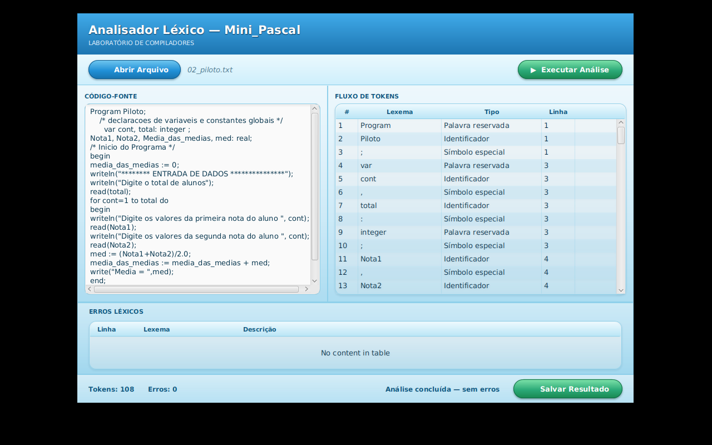

<div align="center">

# 🌀 TokenFlow

### Analisador Léxico para Mini_Pascal

*Trabalho de Compiladores - Unidade I - UESB*


</div>

---

## Sobre o projeto

O **TokenFlow** é um analisador léxico completo para o **Mini_Pascal**, uma linguagem
simplificada inspirada em Pascal. Ele lê um código-fonte (de um arquivo `.txt` ou digitado
diretamente na tela) e devolve, para cada palavra reconhecida, o par **lexema → token**,
seguindo exatamente as classes léxicas exigidas no enunciado da disciplina.

Por trás da interface, o projeto implementa um **Autômato Finito Determinístico** construído
manualmente (sem geradores de lexer prontos), com tratamento de erros que **reporta e
recupera** - um caractere inválido ou uma string mal fechada nunca travam a análise nem
derrubam o resto do arquivo.

## Como é



## Funcionalidades

- ✅ Reconhece todas as classes léxicas do enunciado: palavra reservada, identificador,
  número inteiro/real (com notação científica), operadores aritméticos/relacionais/lógicos,
  símbolo especial, atribuição, fim, constante string e char
- ✅ Tabela de **48 palavras reservadas** oficiais + `mod`/`and`/`or`/`not`, busca O(1),
  **case-insensitive** (`Program`, `PROGRAM` e `program` são todos reconhecidos)
- ✅ Comentários de bloco `/* */`, inclusive multilinha, com recuperação de erro se não
  fecharem
- ✅ Strings e chars mal formados geram erro léxico **sem travar o resto do arquivo**
- ✅ Limite de 63 caracteres em identificadores (truncamento, não erro)
- ✅ Interface gráfica: carregar um `.txt` **ou** digitar/colar código direto na tela
- ✅ Modo linha de comando, pra rodar em lote ou sem interface
- ✅ **96 verificações automatizadas**, incluindo uma bateria dedicada a casos absurdos
  (número colado em identificador, operadores repetidos sem espaço, comentário "aninhado",
  CRLF do Windows, Unicode inválido...)
- ✅ 7 arquivos de teste de integração, incluindo os exemplos exatos do enunciado

## Arquitetura

O código é dividido em camadas com responsabilidade única - o núcleo léxico não sabe nada
sobre arquivos ou sobre a interface, o que permite reaproveitá-lo em qualquer um dos dois
sem duplicar lógica:

```
src/minipascal/lexico/
├── model/          → Token, TipoToken (o "vocabulário" da linguagem)
├── tabela/         → TabelaPalavrasReservadas (busca O(1) via HashMap)
├── core/           → AnalisadorLexico - o autômato em si, o coração do projeto
├── io/              → LeitorArquivoFonte, EscritorArquivoSaida (sempre UTF-8 explícito)
├── gui/             → MainApp, AnalisadorController (interface JavaFX)
├── verificacao/     → suíte de testes própria, sem depender de JUnit
└── Main.java        → ponto de entrada da versão linha de comando
```

```
resources/minipascal/lexico/gui/
├── Main.fxml         → layout da interface
├── application.css   → estilo visual (gradientes, vidro, sem imagem externa)
└── icon.png           → ícone da janela
```

## Como rodar

### Pré-requisito

**JDK 8** com JavaFX embutido (ex: Oracle JDK 8u202). Confirme com:
```bash
java -version
```

> ⚠️ Se você tiver mais de um JDK instalado, garanta que os comandos abaixo estão usando o
> JDK 8 - se tiver dúvida, chame o `java`/`javac` pelo caminho completo
> (`"C:\Program Files\Java\jdk1.8.0_202\bin\java.exe"`).

### 1. Compilar

**Linux/macOS/Git Bash:**
```bash
javac --release 8 -encoding UTF-8 -d out $(find src -name "*.java")
```

**PowerShell:**
```powershell
mkdir out
javac -encoding UTF-8 -d out (Get-ChildItem -Path src -Recurse -Filter *.java).FullName
```

### 2. Rodar a interface gráfica

Os recursos (`Main.fxml`, `application.css`, `icon.png`) precisam estar na mesma pasta dos
`.class` compilados - o `javac` não copia isso sozinho:

```bash
cp resources/minipascal/lexico/gui/*.fxml resources/minipascal/lexico/gui/*.css resources/minipascal/lexico/gui/*.png out/minipascal/lexico/gui/
java -cp out minipascal.lexico.gui.MainApp
```
*(no PowerShell, troque `cp` por `Copy-Item` e `:` por `;` no classpath se for usar mais de
uma pasta)*

### 3. Rodar via linha de comando (sem interface)

```bash
java -cp out minipascal.lexico.Main caminho/entrada.txt caminho/saida.txt
```
Se omitir o segundo argumento, a saída é gravada como `<entrada>_saida.txt`.

### 4. Empacotar um `.jar` executável

```bash
echo "Main-Class: minipascal.lexico.gui.MainApp" > manifest.txt
jar cfm TokenFlow.jar manifest.txt -C out .
java -jar TokenFlow.jar
```

## Como rodar os testes

Cada suíte é uma classe Java independente (sem JUnit), que imprime `[OK]`/`[FALHA]` linha a
linha e termina com um resumo:

```bash
java -cp out minipascal.lexico.verificacao.VerificacaoFase3     # model + tabela
java -cp out minipascal.lexico.verificacao.VerificacaoFase4     # núcleo do lexer
java -cp out minipascal.lexico.verificacao.VerificacaoFase5     # comentários e erros
java -cp out minipascal.lexico.verificacao.VerificacaoFase6     # leitura/escrita de arquivo
java -cp out minipascal.lexico.verificacao.VerificacaoAbsurda   # casos extremos/maldosos
```

## Arquivos de teste

| Arquivo | O que cobre |
|---|---|
| `01_programa_simples.txt` | Exemplo básico do enunciado - saída conferida byte a byte contra o gabarito do professor |
| `02_piloto.txt` | Programa maior, com `for`, strings e comentários |
| `03_com_erro.txt` | Caractere inválido proposital |
| `04_numeros_extremos.txt` | Formatos numéricos no limite (exponentes, pontos múltiplos, número colado em texto) |
| `05_operadores_colados.txt` | Operadores grudados sem espaço, repetidos, inválidos |
| `06_comentarios_e_strings.txt` | Comentário "aninhado", string sem fechar no meio do arquivo |
| `07_casos_extremos_diversos.txt` | Identificador de 100+ caracteres, palavras reservadas em caixa mista, comentário nunca fechado |

## Decisões de projeto

Algumas leituras do enunciado exigiram uma escolha explícita onde o texto original era
ambíguo - todas documentadas e testadas:

- **Busca de palavra reservada é case-insensitive** (o próprio enunciado usa `program` e
  `Program` em exemplos diferentes)
- **`div` é Palavra reservada** (está na lista oficial); **`mod` é Operador aritmético**
  (não está na lista, mas é exigido pelo enunciado)
- **Identificador precisa começar com letra** - `_` só é permitido no meio
- **Constante char aceita exatamente 1 caractere** - vazio (`''`) ou múltiplo (`'ab'`) são erro
- **String não fechada é limitada à linha atual** - evita que uma aspa esquecida engula o
  resto do arquivo inteiro
- **Limite de 63 caracteres em identificador** - o excedente é truncado, não vira erro

## Contexto acadêmico

Trabalho da disciplina de **Compiladores**, curso de Ciência da Computação - UESB.
Corresponde à **Unidade I** (Analisador Léxico). O núcleo (`AnalisadorLexico`) foi projetado
para ser reaproveitado sem modificações na Unidade II (Analisador Sintático), já que não
depende de nada relacionado a arquivo ou interface.

## Autores

<table>
<tr>
<td align="center">
<a href="https://github.com/gabrielmarcone">
<br/>
<sub><b>Gabriel Marcone</b></sub>
</a>
</td>
<td align="center">
<a href="https://github.com/ccaiomatos">
<br/>
<sub><b>Caio Matos</b></sub>
</a>
</td>
</tr>
</table>

---

<div align="center">
<sub>Feito para a disciplina de Compiladores - UESB, 2026</sub>
</div>
